### 👩🏻‍💻 Sobre mim | About me

`PT-BR`
 Me chamo <strong>Denyse Freitas Santos</strong>, tenho 20 anos e sou natural de Minas Gerais, mas fui criada no Espírito Santo. Em 2022, retornei a Minas para cursar o ensino médio integrado ao <strong>Curso Técnico em Informática</strong> no <strong>IFMG — Campus Ponte Nova</strong>. Atualmente, sou estudante de Ciência da Computação na Universidade Federal de Viçosa (UFV).

  

  `US` My name is <strong>Denyse Freitas Santos</strong>, I am 20 years old and I was born in Minas Gerais, but I was raised in Espírito Santo. In 2022, I returned to Minas to attend high school integrated with the <strong>Technical Course in Information Technology</strong> at <strong>IFMG — Ponte Nova Campus</strong>. Currently, I am a Computer Science student at the Federal University of Viçosa (UFV).

***

### 🖥️ Tecnologias | Technologies

***

### 🖥️ Estatísticas | Statistics

 

 

***

### 📌 Projetos em Destaque | Featured Projects

> `PT-BR` Alguns projetos que demonstram a aplicação do meu aprendizado em programação.  

> `US` Some projects that demonstrate how I apply my programming skills.

   

***

 
 ### 📂 Outros Projetos | Other Projects
- [Exercícios de Java (POO) | Java exercises (OOP)](https://github.com/denysefreitas/listas-java-poo)
- [Exercícios de Python | Python exercises](https://github.com/denysefreitas/listas-python)
  

